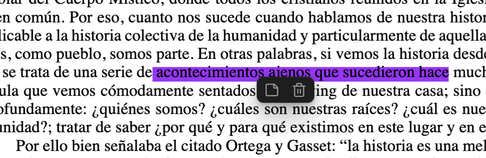
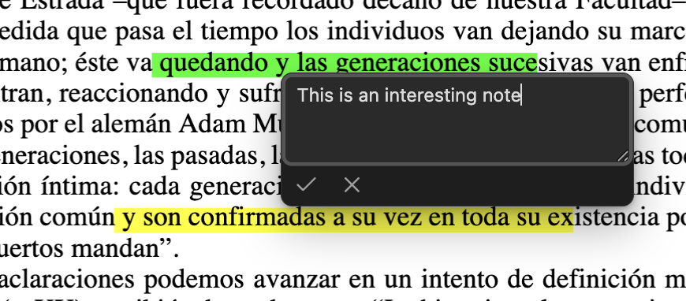
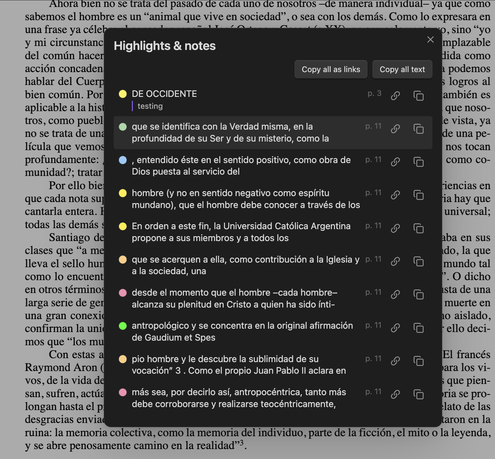

# Study PDF

Highlight text and take notes in PDFs from inside Obsidian. Everything is written as
standard PDF annotations directly into the `.pdf` file, so it's portable — highlights
and notes show up in Obsidian's built-in PDF viewer (including inline
`![[file.pdf#page=3]]` embeds) as well as in Adobe Acrobat, Apple Preview, and any
other PDF reader. The file itself is the source of truth; nothing is stored on the
side.

## Screenshots

| Click a highlight | Add a note | Browse everything |
| --- | --- | --- |
|  |  |  |

## Features

- **Highlight**: select text in an open PDF and pick a color from the popup that
  appears (or use the *Highlight selection* command). One quad per line, standard
  `/Highlight` annotations with a real appearance stream, so every reader renders
  them. Size and colors are calibrated to match desktop marker tools.
- **Notes**: click a highlight and use the note button in the popup. The note is
  stored in the annotation's `/Contents` — the standard field — so it appears as the
  highlight's comment in Adobe/Preview too. Unicode-safe.
- **Remove**: click a highlight, hit the trash button (or the *Remove highlight at
  selection* command).
- **Overview**: *Show all highlights and notes* lists every highlight in the document
  (color, recovered quoted text, note, page), with click-to-jump and copy buttons —
  as Obsidian annotation deep links (`#page=N&annotation=ID`) or as plain Markdown.
- **Encrypted PDFs**: permission-restricted files (owner password, no open password —
  the common "protected" textbook/scan) are decrypted transparently. Note the saved
  file comes out decrypted. Files that genuinely require a password to open are
  rejected with a clear message.
- **No flicker**: Obsidian fully reloads a PDF view whenever the file changes on
  disk; a snapshot "curtain" (with the new highlight pre-painted) masks the reload,
  so feedback is instant.

## Safety

The PDF is fully re-serialized on every save (that's how pdf-lib works), so every
write is verified before it touches your file: the output is re-parsed and checked
(page count, annotation counts) and the write is aborted loudly if anything looks
wrong. Non-highlight annotations — links, form fields, XFA — are covered by
round-trip tests against real-world PDFs.

Still: this plugin **modifies your PDF files in place**. Keep backups of documents
you care about, especially the first time you use it on a new kind of PDF.

To keep its popup UI from colliding with Obsidian's built-in annotation popup, the
plugin patches one internal viewer method (restored on unload) and reads the viewer's
internal PDF.js objects. An Obsidian update can break these integration points; the
plugin fails loudly with a clear message rather than misbehaving silently.

## Development

```bash
npm install
npm run dev     # esbuild watch mode
npm run build   # typecheck + production build -> main.js
npm test        # vitest — geometry/annotate unit + round-trip tests
npm run lint    # eslint-plugin-obsidianmd -- same checks the community-plugin review does
```

To try it in a vault: build, then symlink `main.js`, `manifest.json`, and `styles.css`
into `<vault>/.obsidian/plugins/study-pdf/`, then reload Obsidian and enable the
plugin under Community Plugins.

### Releases

Releases are built and published entirely by [GitHub Actions](.github/workflows/release.yml)
from a pushed version tag (e.g. `0.1.0`, no `v` prefix) — never uploaded from a local
machine. Each release asset (`main.js`, `manifest.json`, `styles.css`) carries a
[build provenance attestation](https://docs.github.com/en/actions/security-for-github-actions/using-artifact-attestations/using-artifact-attestations-to-establish-provenance-for-builds),
so anyone can verify it was built from this repository's source:

```bash
gh attestation verify <(curl -sL https://github.com/gris/study-pdf/releases/download/<version>/main.js) --repo gris/study-pdf
```

`npm run lint` should exit clean. The two intentional exceptions (a version-gated
settings-tab call the linter can't statically verify as safe) are downgraded to
warnings in `eslint.config.mjs`, with the reasoning next to each call site in
`src/settings.ts`.

### Code map

- `src/annotate.ts` — all PDF mutation (add/remove/note/inspect), pure, no Obsidian
  imports. Uses `@cantoo/pdf-lib` (pdf-lib fork with decryption support).
- `src/geometry.ts` — pure coordinate mapping: selection rects → PDF `QuadPoints`,
  calibrated against reference marker software.
- `src/obsidian-pdf-internals.ts` — the ONLY module touching undocumented
  Obsidian/PDF.js internals (viewer access, native popup suppression).
- `src/ui/` — icon popup, note editor, reload curtain, highlights list modal.
- `src/settings.ts`, `src/main.ts` — settings tab and plugin wiring.

## Known limitations

- Password-protected PDFs (real open password) can't be modified.
- Scanned PDFs without a text layer can't be text-highlighted.
- Annotation deep links can break for a highlight if the file is later re-saved
  (object numbers may shift); the page part of the link keeps working.
- Desktop only for now.
